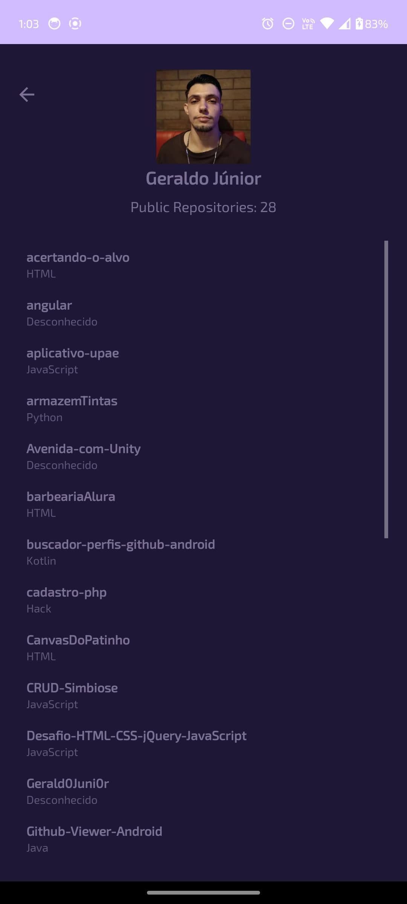

# GitHub Viewer 🚀

Um aplicativo Android que permite buscar perfis do GitHub e visualizar informações sobre seus repositórios públicos.

## 🐜 Sobre o projeto
O GitHub Viewer é um aplicativo desenvolvido em Java + Retrofit que permite pesquisar perfis do GitHub pelo nome de usuário e visualizar suas informações, incluindo:

##### ✔️ Foto de perfil
##### ✔️ Nome de usuário
##### ✔️ Quantidade de repositórios públicos
##### ✔️ Lista de repositórios públicos (com nome e linguagem de programação)

## 📸 Capturas de Tela
| Tela Inicial | Perfil do Usuário | Sem internet | Usuário não encontrado | Vazio |
|-------------|------------------|-------------|------------------|------------------|
|  |  |  |  |  | 

## 📌 Funcionalidades
- 🔍 Busca de usuários do GitHub pelo nome de usuário.
- 📄 Exibição das informações do perfil: avatar, nome e número de repositórios públicos.
- 📂 Listagem de todos os repositórios públicos do usuário.
- ⚠️ Alertas em caso de erro na busca (usuário não encontrado ou erro de conexão).
- 🔙 Botão de voltar para a tela inicial.

## 🛠️ Tecnologias Utilizadas
- **Linguagem:** Java ☕
- **Framework:** Android SDK 📱
- **Bibliotecas:**
    - [Retrofit](https://square.github.io/retrofit/) - Para requisições à API do GitHub.
    - [Glide](https://github.com/bumptech/glide) - Para carregar imagens de perfil.

## 📺 API Utilizada
Este projeto consome a API do GitHub para buscar informações dos usuários e seus repositórios.

🔗 Endpoint usado:

```sh
https://api.github.com/users/{username}/repos
```

## 📌 Pré-requisitos
Antes de rodar o projeto, certifique-se de ter:

##### 🔹 Android Studio instalado
##### 🔹 Emulador configurado ou um dispositivo físico conectado
##### 🔹 Conexão com a internet para buscar perfis no GitHub

## 📦 Instalação e Execução
1. Clone este repositório:
   ```sh
   git clone https://github.com/seu-usuario/github-viewer.git
   ```
2. Abra o projeto no Android Studio
3. Execute o projeto em um emulador ou dispositivo físico
4. Pesquise por um nome de usuário do GitHub e veja as informações carregadas! 🎉
